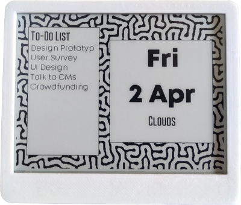

# Wave



## Install Library Dependencies (from arduino library manager)
  - Adafruit GFX library by Adafruit (tested with v1.7.5)
  - GxEPD by Jean-Marc Zingg version (tested with v3.0.9)
  - JSON Streaming Parser by Daniel Eichhorn (tested with v1.0.5)

## Usage
### Step 1:
Use [ESP32 Sketch data upload](https://randomnerdtutorials.com/install-esp32-filesystem-uploader-arduino-ide/) to upload the images from data folder.
### Step 2:
Update the config.h file with configuration details
```
#define SSID     "*****" // your network SSID (name of wifi network)
#define PASSWORD "*****" // your network password
#define TODOIST_TOKEN "*******" // your todoist API key without the word "Bearer"
#define CITY "*****" // your city for weather
#define COUNTRY "*****" // your country for weather
#define OWM_ID "*****" // your open weather map APP ID
#define TIME_ZONE "-05:30" // your time zone. -05:30 is for India.
#define START_DAY_OFFSET 0 // Offset to change start day. 0=>Sun, 1=>Sat, 2=>Fri ... 6=>Mon
#define FORECAST_HOURS 9 // Show forecasted weather this many hours from update time. 0 for current weather
#define NUM_IMAGES 5 // Number of images in data folder. Will cycle through these images
#define UPDATES_PER_DAY 1
// Number of times to update starting 12am
// 1 = Updates every 24 hours 
// 2 = Updates every 12 hours
// 3 = Updates every 8 hours. Not a good idea since it won't line up with day changes.
// 4 = Updates every 6 hours
// ... and so on
// Higher number means lower battery life
```
### Step 3:
Select `ESP32 Dev module` in arduino `Tools>Board` and hit upload.

## Fonts used
- https://7ntypes.com/gobold-font-updated/
- https://www.fontfabric.com/fonts/mont/
